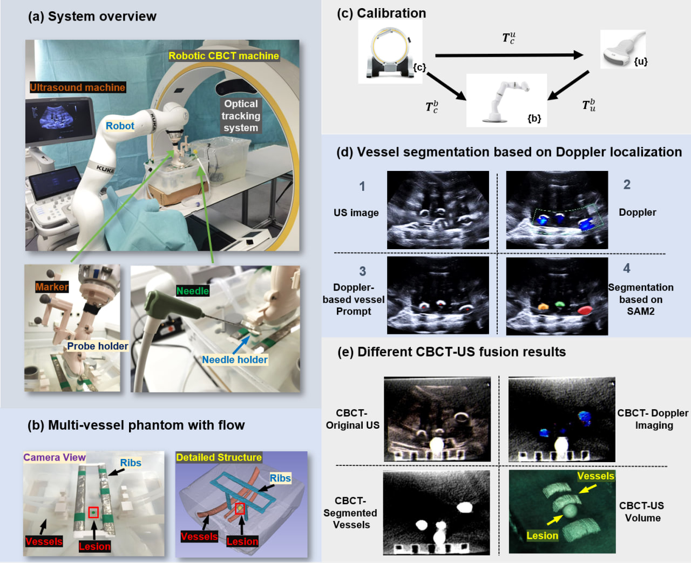

# Robotic CBCT Meets Robotic Ultrasound (IPCAI 2025 paper)

<center>Feng Li*, Yuan Bi*, Dianye Huang, Zhongliang Jiang, Nassir Navab</center>

<center>CAMP, Technical University of Munich</center>
<center>IPCAI 2025</center>

## Abstract

**Purpose:** The multi-modality imaging system offers optimal fused images for safe and precise interventions in modern clinical practices, such as computed tomography - ultrasound (CT-US) guidance for needle insertion. However, the limited dexterity and mobility of current imaging devices hinder their integration into standardized workflows and the advancement toward fully autonomous intervention systems. In this paper, we present a novel clinical setup where robotic cone beam computed tomography (CBCT) and robotic US are pre-calibrated and dynamically co-registered, enabling new clinical applications. This setup allows registration-free rigid registration, facilitating multi-modal guided procedures in the absence of tissue deformation.
**Methods:** First, a one-time pre-calibration is performed between the systems. To ensure a safe insertion path by highlighting critical vasculature on the 3D CBCT, SAM2 segments vessels from B-mode images, using the Doppler signal as an autonomously generated prompt. Based on the registration, the Doppler image or segmented vessel masks are then mapped onto the CBCT, creating an optimally fused image with comprehensive detail. To validate the system, we used a specially designed phantom, featuring lesions covered by ribs and multiple vessels with simulated moving flow.
**Results:** The mapping error between US and CBCT resulted in an average deviation of 1.72 ± 0.62 mm. A user study demonstrated the effectiveness of CBCT-US fusion for needle insertion guidance, showing significant improvements in time efficiency, accuracy, and success rate. Needle intervention performance improved by approximately 50% compared to the conventional US-guided workflow. **Conclusion:** We present the first robotic dual-modality imaging system designed to guide clinical applications. The results show significant performance improvements compared to traditional manual interventions.

## Pipeline



## Videos

<iframe width="960" height="540" src="https://www.youtube.com/embed/2Q3SQxSf_d0?si=NLFhlgIX_IRwoXxO" title="YouTube video player" frameborder="0" allow="accelerometer; autoplay; clipboard-write; encrypted-media; gyroscope; picture-in-picture; web-share" referrerpolicy="strict-origin-when-cross-origin" allowfullscreen></iframe>

## Cite Us

## 

```
@article{li2025robotic,
  title={Robotic CBCT meets robotic ultrasound},
  author={Li, Feng and Bi, Yuan and Huang, Dianye and Jiang, Zhongliang and Navab, Nassir},
  journal={International Journal of Computer Assisted Radiology and Surgery},
  pages={1--9},
  year={2025},
  publisher={Springer}
}
```

